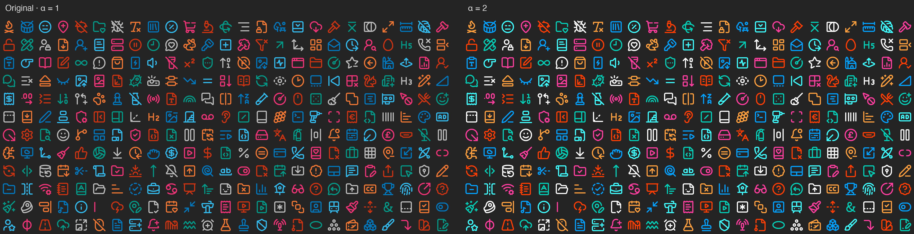

# Opacity Is Not Just Opacity

**[Online demo](https://ln-one.github.io/opacity-is-not-just-opacity/demo/)** · [Paper PDF](output/preprint/opacity-is-not-just-opacity.pdf) · [Manuscript](markdown/manuscript.en.md) · [Reproduction guide](experiments/formal-evaluation/README.md)

**Chunran Zhang · Southwest Jiaotong University**

Extend alpha beyond 1 to enhance object–background color differences, keeping the source colors and compositing equation fixed.

$$
C_o=\mathrm{clip}_{[0,1]}\left(C_b+\alpha(C_s-C_b)\right).
$$

Code: [MIT](LICENSE). Manuscript and third-party materials: [licensing](NOTICE.md).
