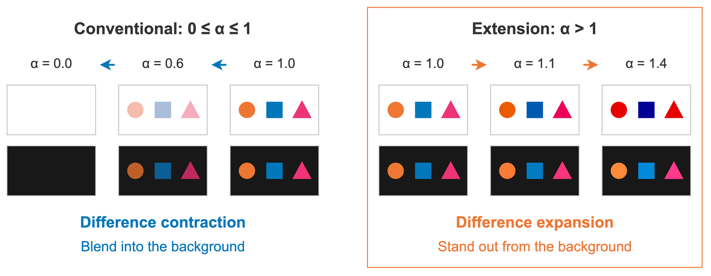

## 3. Method

All color calculations and property analyses in this section use real-valued linear RGB. Figure 1 summarizes the conventional and extended coefficient ranges.

{#fig:method}

### 3.1 Compositing

Let $C_s$ and $C_b$ be the non-premultiplied source and background colors, with alpha values $\alpha_s,\alpha_b\in[0,1]$. Standard source-over compositing gives [@porterDuff1984; @w3cCompositing]

$$
c_o=\alpha_sC_s+(1-\alpha_s)\alpha_bC_b,
\qquad
\alpha_o=\alpha_s+(1-\alpha_s)\alpha_b.
$$

For $\alpha_o>0$, the output color is $C_o=c_o/\alpha_o$. Once background layers are composited onto the final opaque canvas, $\alpha_b=1$, giving

$$
C_o=\alpha_sC_s+(1-\alpha_s)C_b.
$$

### 3.2 From Transparency to Expansion of Color Differences

In the conventional domain, $\alpha=1$ means full opacity, with the output equal to the source color. Writing the relationship between output and background as

$$
C_o-C_b=\alpha(C_s-C_b)
$$

shows that the source color corresponds to a difference-scaling coefficient of one. Restricting the coefficient to $[0,1]$ allows the difference only to remain unchanged or contract; the equation does not require scaling to stop there.

We extend the coefficient domain to $\alpha\in[0,+\infty)$ while retaining the original expression:

$$
C_{\mathrm{raw}}=\alpha C_s+(1-\alpha)C_b.
$$

Its difference from the background satisfies

$$
C_{\mathrm{raw}}-C_b=\alpha(C_s-C_b).
$$

For $\alpha\in[0,1)$, the difference contracts; at $\alpha=1$, the source color is preserved; for $\alpha\in(1,+\infty)$, the difference expands. If $C_s=C_b$, every coefficient gives $C_{\mathrm{raw}}=C_b$: a zero difference cannot be amplified.

Relative luminance satisfies the same relationship:

$$
Y_{\mathrm{raw}}-Y_b=\alpha(Y_s-Y_b).
$$

Thus, when source and background luminances differ and the output remains in gamut, $\alpha>1$ increases the contrast ratio.

Per-channel clipping to $[0,1]$ gives the final output:

$$
C_o=\operatorname{clip}_{[0,1]}(C_{\mathrm{raw}}).
$$

Within the conventional range $\alpha\in[0,1]$, clipping leaves the result unchanged, preserving ordinary compositing in full. The same compositing property thus adds expansion while preserving its transparency effects.

### 3.3 Background Contrast Enhancement with Fixed Objects

Expansion takes the actual background as its reference. For a fixed source color $C_s$ and coefficient $\alpha$, a change in the background produces

$$
\Delta C_{\mathrm{raw}}=(1-\alpha)\Delta C_b.
$$

For $\alpha>1$, the unclipped output changes in the opposite direction to the background. Fixed $C_s$ and $\alpha$ therefore specify an enhancement rule whose direction adapts to the actual background. The application supplies the resolved $C_b$ at compositing time. With the same color space and clipping pipeline, both coefficient ranges execute the same expression, preserving the per-pixel arithmetic operation count. This adaptation uses the object's existing parameters and the original computation, with no additional color-search or optimization stage.

### 3.4 Enhancement Strength, Color Separation, and Background Differences

The coefficient in a fixed configuration controls the extent of expansion. For two objects using the same coefficient on the same background, their unclipped outputs satisfy

$$
C_{\mathrm{raw},i}-C_{\mathrm{raw},j}
=\alpha(C_{s,i}-C_{s,j}).
$$

The common background term cancels, so the difference between objects scales by the same factor. For $\alpha>1$, the same coefficient therefore expands both object-background and inter-object RGB differences before clipping.

Clipping can nevertheless reduce color separation or map distinct source colors to the same output. Lowering the coefficient reduces clipping, controlling the tradeoff between background contrast enhancement and color separation between objects. The coefficient thus determines both the enhancement strength and the color-separation cost of a fixed configuration.

This convergence occurs between objects; their differences from the background are preserved. For $\alpha\in[1,+\infty)$, the final output, including clipping, satisfies

$$
|C_{o,k}-C_{b,k}|
\geq |C_{s,k}-C_{b,k}|.
$$

Consequently, for any $1\leq p\leq\infty$,

$$
\|C_o-C_b\|_p\geq\|C_s-C_b\|_p.
$$

The RGB distance from the output to the background does not decrease. On black and white backgrounds, this per-channel guarantee also directly implies a nondecreasing contrast ratio. On black backgrounds, $C_{o,k}\ge C_{s,k}$ in every channel, so relative luminance does not decrease. On white backgrounds, $C_{o,k}\le C_{s,k}$ in every channel, so relative luminance does not increase. Both cases preserve or increase the contrast ratio against the background, including after clipping.
