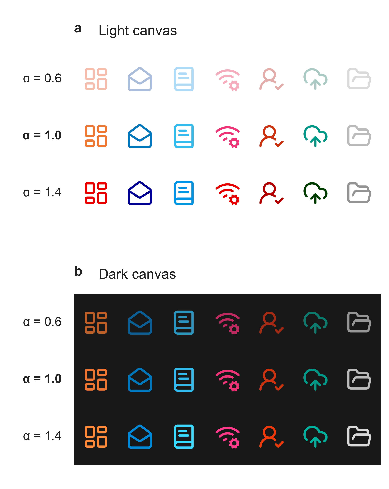
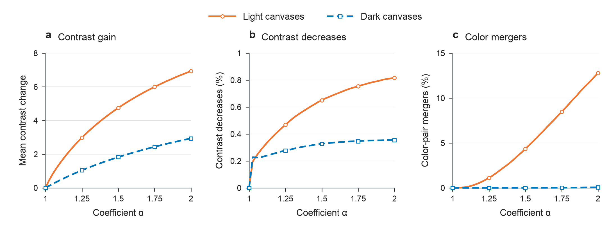
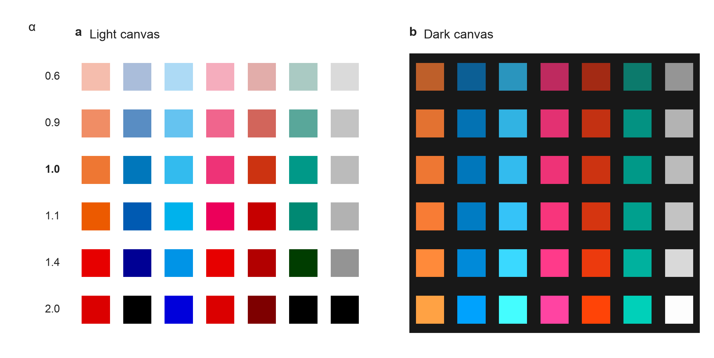
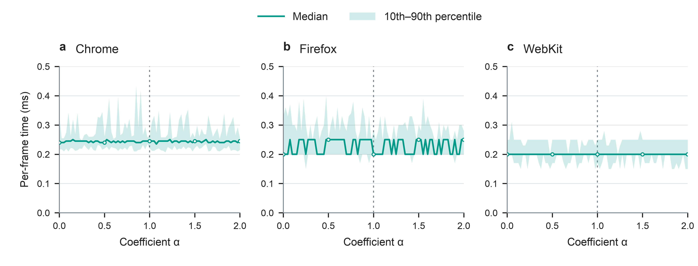

## 4. 实验

### 4.1 实验设置

我们分别评估背景对比增强、对象间区分和 Web 运行开销。每次比较固定源颜色与系数，由实际背景参与计算输出。

数值实验在 16 种黑白、近黑近白及轻微带色的画布上枚举全部 $256^3$ 种 8 位 sRGB 源颜色；以 $65^3$ 源颜色扫描 $\alpha\in[0,2]$，步长为 0.025；再用 $17^3$ 种源颜色与 $33^3$ 种背景的组合扩大背景覆盖范围。

所有配置均在线性 RGB 中计算并逐通道截断，以原色（$\alpha=1$）为基准，比较亮度对比度变化，并加入 Difference 和 Exclusion 混合模式作为参照。对象间区分采用 CIEDE2000 色差和 8 位输出的颜色重合率，覆盖 Vibrant 的全部不同色对及固定种子生成的 65,536 对不同源颜色。

### 4.2 背景自适应与对比增强

同一组源图标与系数，在亮暗画布上形成相应输出：$\alpha<1$ 使图标融入背景，$\alpha>1$ 使输出沿远离背景颜色的方向变化（图 2）。

*图 2．固定图标的背景适应。各行对应 $\alpha=0.6、1.0、1.4$，各列保持相同的图标与源颜色。示例以 192 px 渲染。*

在全部源颜色与 16 种画布的组合中，$\alpha=1.1$ 使 99.8145% 的组合提高亮度对比度，平均增益为 0.9783。同一条件下，Difference 和 Exclusion 的平均增益分别为 −1.3050 和 −1.3104。

背景范围影响增强效果。黑白画布上未发现亮度对比度下降，其他预设画布存在下降案例；扩大到广泛背景网格后，下降比例进一步增加（表 1）。

**表 1．不同背景范围下的亮度对比度变化。**

| 系数 | 预设画布：提高（%） | 预设画布：下降（%） | 广泛背景：提高（%） | 广泛背景：下降（%） |
|---|---:|---:|---:|---:|
| 1.1 | 99.8145 | 0.1853 | 90.3672 | 9.3318 |
| 1.4 | 99.6132 | 0.3867 | 86.7022 | 12.9968 |

*预设画布实验枚举全部 8 位源颜色；广泛背景实验使用 $17^3$ 源颜色与 $33^3$ 背景网格。其余组合在数值容差内保持不变。*

固定系数在预设亮暗画布上产生广泛的对比增强；扩大背景范围后，对比度下降的比例增加。

### 4.3 系数与对象间区分

背景对比增强并不保证对象间区分。增大系数提高了平均对比度增益，也增加了不同源颜色产生相同输出的情况。

*图 3．系数与增强效果、代价的关系。（a）平均亮度对比度变化；（b）对比度下降比例；（c）8 位输出的颜色重合率。每组八种画布等权汇总；（a–b）使用 $65^3$ 源颜色，（c）使用 65,536 对不同源颜色。图中包含 $[1,2]$ 内全部 41 个测量点。*

对于 Vibrant 的 336 个色对—画布组合，$\alpha=1.1$ 时有 32 个组合的色差下降，没有颜色重合；$\alpha=1.4$ 时，色差下降增至 88 个组合，其中 8 个产生相同输出。随机色对的 1,048,576 个组合中，颜色重合数也从 617 增至 15,098。

图 4 展示了截断造成的变化：部分颜色逐渐到达通道边界，不同源颜色趋同。降低系数减轻这种趋同，同时降低背景增强的幅度。

*图 4．Vibrant 全部七种源颜色的输出。各列固定源颜色，各行改变系数；左右分别为白色和近黑色画布。*

### 4.4 Web 实现与运行开销

WebGL 实现沿用同一合成表达式，由对象提供源颜色与系数，由应用管理的画布提供背景颜色；几何覆盖率单独处理抗锯齿边缘。300 枚 Lucide 图标在三种尺寸、16 种画布和九种配置下，共生成 388,800 个跨浏览器显示实例。Chrome、Firefox 和 WebKit 的所有非零覆盖像素与 CPU 参考值的最大通道误差均不超过 $1/255$。

在同一 Apple M4 Pro 设备上，三个浏览器分别扫描全部 81 个系数。每个系数测量 25 组，每组连续绘制 20 帧；每轮随机排列系数，共计 121,500 个计时帧。

*图 5．全系数运行耗时。实线为组均值的中位数，阴影为经验 10%–90% 分位数，竖虚线标记 $\alpha=1$。每帧绘制 300 枚图标并同步读回一个像素。Firefox 与 WebKit 的区块计时呈整毫秒阶梯。*

Chrome 的各系数耗时中位数为 0.235–0.250 ms，Firefox 为 0.200–0.250 ms，WebKit 均为 0.200 ms。在同一绘制与同步读回流程中，系数从常规区间进入扩展区间，未出现持续的耗时上升。
