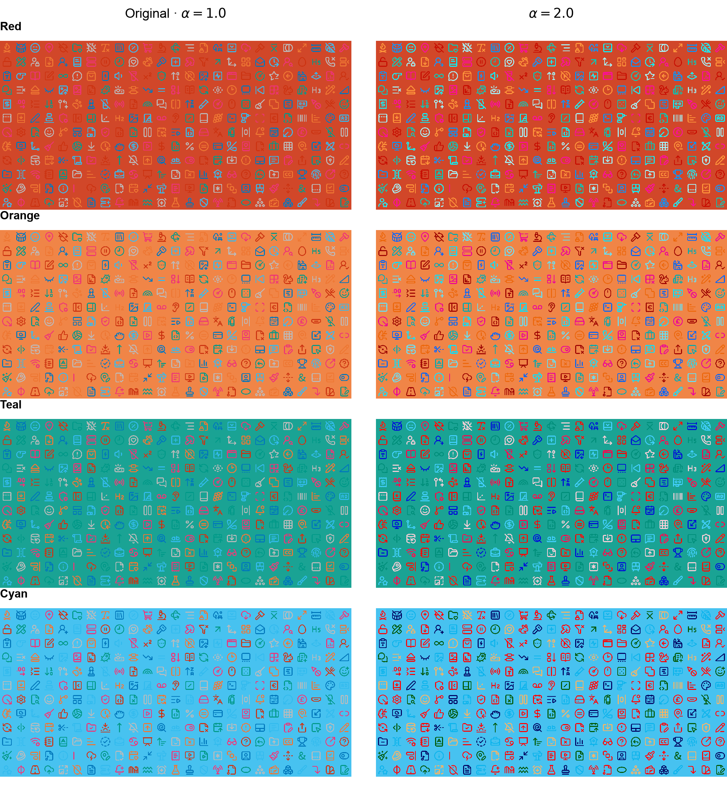
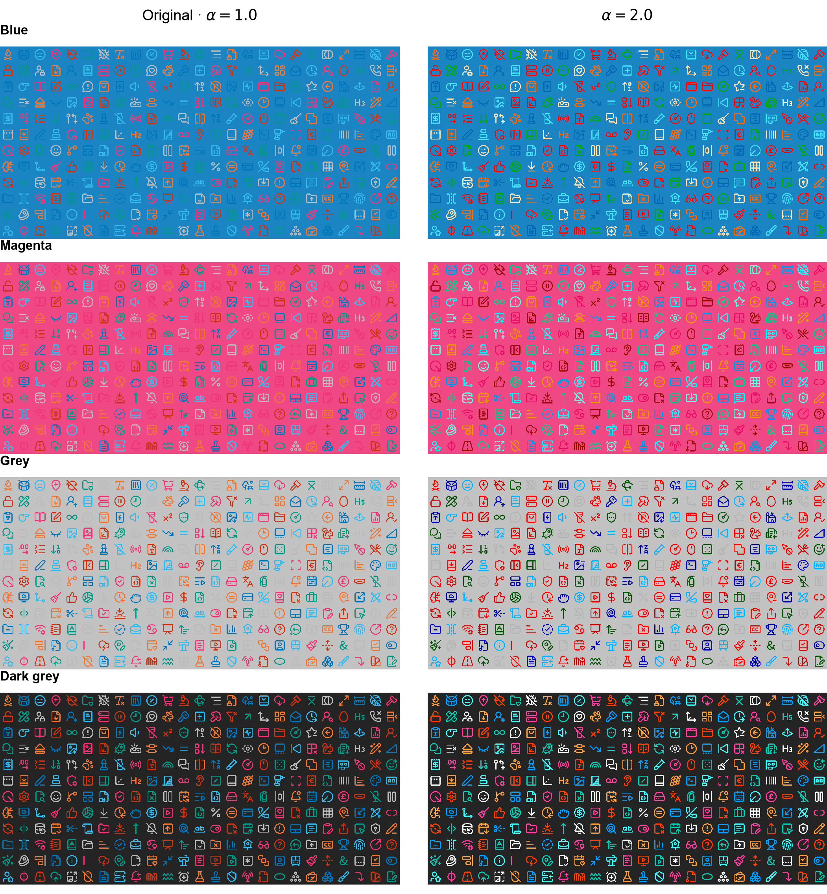

## A. Reproducibility Details

### A.1 Color Processing and Metrics

Encoded sRGB inputs are decoded to linear sRGB before compositing [@cssColor4]. Relative luminance is $Y(C)=0.2126C_R+0.7152C_G+0.0722C_B$, and the contrast ratio is [@wcag22]

$$
\operatorname{CR}(C_o,C_b)
=\frac{\max(Y_o,Y_b)+0.05}{\min(Y_o,Y_b)+0.05}.
$$

The reference is the contrast ratio of the original source color against the same background. Changes with absolute magnitude at most $10^{-10}$ are counted as unchanged. Numerical calculations use 64-bit floating-point values. Difference uses $|C_s-C_b|$ and Exclusion uses $C_s+C_b-2C_sC_b$, with componentwise operations in the same linear space.

Source and background grids are uniformly spaced in encoded sRGB, including both endpoints, and then decoded. The predefined set comprises eight light and eight dark canvases, including neutral and mildly tinted colors. Exact sRGB values are recorded in the experiment configuration.

For CIEDE2000, linear sRGB colors are converted to CIELAB using the sRGB D65 white point. Color-difference decreases use a tolerance of $10^{-9}$. Collisions are evaluated after sRGB encoding and rounding to 8-bit values, with ties rounded to even. Random pairs use NumPy's default generator with seed 20260913. The evaluation retains equal-color background cases and neutral source colors. It measures numerical color separation, not human recognition or full-page accessibility compliance.

### A.2 Rendering and Timing

Icons come from `lucide-static` version 1.45.0. The corpus contains the first 300 SVG paths ordered by their SHA-256 path hashes, independently of rendering outcomes. Source colors cycle through the seven Vibrant colors. Browser validation uses 16, 24, and 48 px icons; the nine configurations are $\alpha\in\{0.6,0.9,1,1.05,1.1,1.2,1.4\}$, Difference, and Exclusion.

The shader obtains geometric coverage $q\in[0,1]$ from the rasterized icon mask and computes

$$
C_{\mathrm{pixel}}=q\,\operatorname{clip}_{[0,1]}
\bigl(C_b+\alpha(C_s-C_b)\bigr)+(1-q)C_b.
$$

The result is encoded to sRGB for output. Coverage and the extended coefficient are separate, so antialiasing retains conventional edge coverage. The application supplies the already-composited background; the prototype does not read arbitrary DOM backgrounds or change native CSS opacity semantics.

Timing uses a $1280\times960$ canvas with 300 icons at 48 px. Backgrounds alternate between a warm light canvas and a cool dark canvas. Each browser runs two warm-up sweeps, followed by 25 rounds over all 81 coefficients. A seeded Fisher-Yates permutation changes the order in each round; all browsers use the same schedule. Every frame ends with synchronous one-pixel readback. The elapsed `performance.now()` interval for 20 frames is divided by 20 to obtain a block mean. All 25 blocks per coefficient are retained. Reported times include draw submission and readback, rather than measuring GPU arithmetic alone.

### A.3 Preservation of Background Distance

For each channel, write $s=C_{s,k}$ and $b=C_{b,k}$, with $s,b\in[0,1]$ and $\alpha\geq1$. If $s\geq b$, then $b+\alpha(s-b)\geq s$; clipping leaves the output in $[s,1]$. If $s\leq b$, clipping leaves it in $[0,s]$. In both cases, $|C_{o,k}-b|\geq|s-b|$. Taking any $\ell_p$ norm gives the inequality in Section 3.4. This statement concerns real-valued RGB distances before output quantization.

### A.4 Visual Examples across Backgrounds

Figures 6 and 7 show all 300 icons on eight backgrounds: seven near-source colors obtained by mixing a Vibrant color with 10% white in encoded sRGB, and a dark grey canvas. Each pair compares $\alpha=1$ and $2$ with fixed source colors. These selected cases illustrate appearance rather than recognition performance.

{#fig:gallery1}

{#fig:gallery2}
